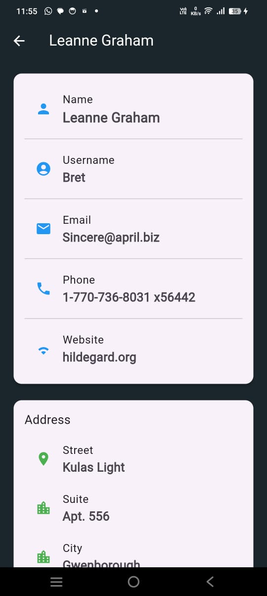
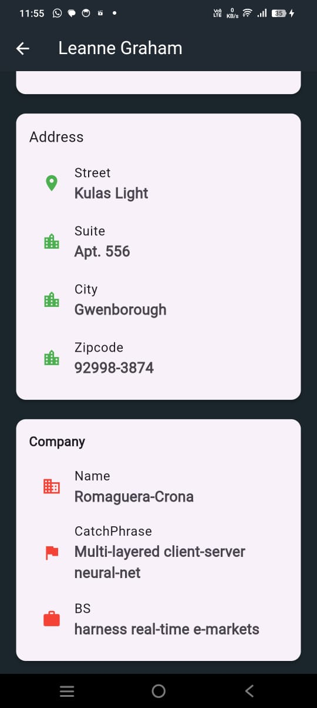

# user_data

A new Flutter project to fetch user data from API

# Description
In this App we can see the User's data especially their name wise in Homescreen and all their details in Details page.

# Features
 - Fetch and display a list of users from a API.
 - Loading indicator while fetching data.
 - Pull-to-refresh functinality for easy refresh.
 - Search functionality to filter user by name.
 - Detailed screen for each with addintional user information.
 - Internet connection check and error handling

# Screenshots
 

 

 
 
 
 
 

# To run this app
  clone the repository 

  1) git clone<https://github.com/adilrusfeed/UserData>

  2) cd UserData

  3) run "pubget" to fetch dependencies
  

## Getting Started

This project is a starting point for a Flutter application.

A few resources to get you started if this is your first Flutter project:

- [Lab: Write your first Flutter app](https://docs.flutter.dev/get-started/codelab)
- [Cookbook: Useful Flutter samples](https://docs.flutter.dev/cookbook)

For help getting started with Flutter development, view the
[online documentation](https://docs.flutter.dev/), which offers tutorials,
samples, guidance on mobile development, and a full API reference.
